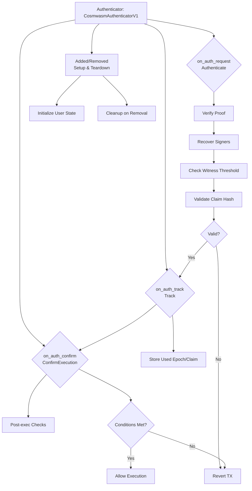

# terp-zktls

This library extends the BTSG Authenticator Trait to implement a **ZK-TLS Proof Account Authenticator** for the `x/smart-account` module. It enables zero-knowledge authentication of transactions based on TLS session proofs, allowing users to prove claims *(e.g., "I accessed a website with specific parameters")* without revealing sensitive data.

Authorize actions via zktls-proof verification.

## x/smart-account integration

---

### Zk-Proof Specifications

These are defined in `src/zk_tls.rs` (or equivalent). Import via `use crate::zk_tls::*;`.

### Structs

| Struct | Description | Fields |
|--------|-------------|--------|
| `ClaimInfo` | Metadata for the claim (provider, params, context). Hashes to EVM-style address. | `provider: String`, `parameters: String`, `context: String` |
| `CompleteClaimData` | Core claim payload. Serializes to string for signing. | `identifier: String`, `owner: String`, `epoch: u64`, `timestampS: u64` |
| `SignedClaim` | Claim + threshold signatures (hex strings, EVM recovery). | `claim: CompleteClaimData`, `signatures: Vec<String>` |
| `Proof` | Full ZK-TLS proof: claim info + signed claim. Provided in auth requests. | `claimInfo: ClaimInfo`, `signedClaim: SignedClaim` |

- Epochs & Witnesses: Claims require `minimum_witness_for_claim_creation` signatures from a pool of witnesses, selected pseudo-randomly via fetch_witness_for_claim.

### Functions

| Function | Purpose | Inputs | Outputs |
|----------|---------|--------|---------|
| `append_0x(content: &str) -> String` | Prepends "0x" to hex strings (EVM compat). | Hex string slice. | "0x"-prefixed string. |
| `keccak256(message: &str) -> Vec<u8>` | EVM-style hash for Ethereum signed messages. | Message string. | 32-byte digest. |
| `generate_random_seed(bytes: Vec<u8>, offset: usize) -> u32` | Pseudo-random seed from hash bytes. | Bytes, offset. | u32 seed. |
| `fetch_witness_for_claim(epoch: Epoch, identifier: String, timestamp: Timestamp) -> Vec<Witness>` | Selects threshold witnesses pseudo-randomly from epoch pool. | Epoch, ID, timestamp. | Vec of `Witness` clones. |
| `ClaimInfo::hash(&self) -> String` | Keccak256 hash of claim fields, "0x"-prefixed. | Self. | Hex hash string. |
| `CompleteClaimData::serialise(&self) -> String` | Concatenates fields for signing. | Self. | Newline-separated string. |
| `SignedClaim::recover_signers_of_signed_claim(self, deps: DepsMut) -> Result<Vec<String>, ContractError>` | Recovers signer addresses from signatures (ECDSA). | Self, deps (unused). | Vec of "0x"-prefixed addresses. |

- **Epoch & Witness**: Assumed defined in `crate::state` (e.g., `Epoch { id: u64, minimum_witness_for_claim_creation: u32, witness: Vec<Witness> }`; `Witness` likely pubkey/address).

### Authentication Process

#### 1. `on_auth_request` – Authenticate

Verifies the authenticity of a proof without storing any state.

| Field | Description |
|------|-------------|
| **Trigger** | Incoming authentication request |

---

#### 2. `on_auth_track` – Track

Prevents replay attacks by recording used claims or epochs.

| Field | Description |
|------|-------------|
| **Trigger** | After successful `on_auth_request` |

---

#### 3. `on_auth_confirm` – Confirm Execution

Enforces business logic after execution context is known.

| Field | Description |
|------|-------------|
| **Trigger** | Post-execution confirmation hook |

---

#### 4. Added/Removed – Lifecycle Setup & Teardown

| Field | Description |
|------|-------------|
| **Added (Setup)** | Initialize per-account state: - `user_epochs[addr] = current_epoch` - `claim_tracker[addr] = {}` |

---

> 💡 **Note**: To automatically apply these logic changes in your codebase, consider switching to **Agent Mode** using the Mode Selector dropdown.
