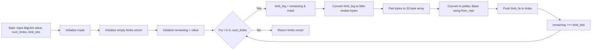
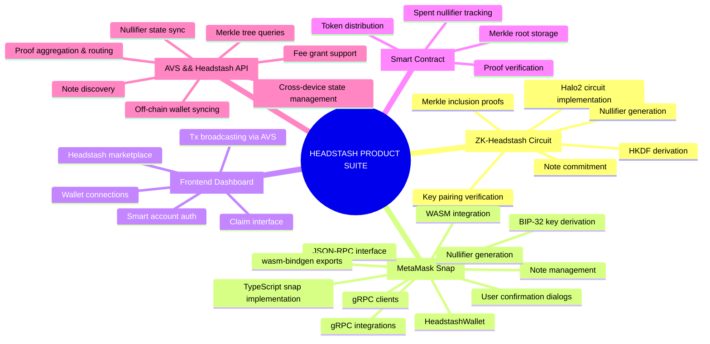

# TODO

## Testing Suite

- implmenet overall testing suite structure for all crates in workspace

## Headstash Indexer/API

- we need to store host, and retrieve data related to headstash distributions. Use cnardium + commonware node for storage and api (see ergors)
- canonical workflow for a pubkey to search for any headstashes they are eligible for (used when snap-pugin syncs on first install and any time plugin request to sync)

## Snap-n-pull - MVP

- refactor msg and proof input building logic with use of the HeadstashSuite orchestration client that has the headstash traits implemented (we are replacing the zcash specification that exists due tto this being a fork of an existing metamask-snap for zcash, but we are going to use it for our purposes)

- broadcast msgs to network using the dedicated smart-account authenticator (using non_crititcal_tx_extension) (uses headstash contract address as authenticator)

## HeadstashSuite

- implement grpc request for headstash api
- sync with headstash api




# Airdrop - Terp Network

> ## One Note: This is experiemental repo, unaudited, and not yet a stable release

Welcome! This workspace contains the logic for generating, implementing, and deploying headstash instances.

| Package |Description   |   |
|---------------------------|------| -|
| docs | documentation and specification of the circuit layout and tooling
| zk-crates | libraries for proof circuit generation and implementation | |
| zk-packages | js libraries for wasm-bindgen related fun | |
| pub-crates | libraries for logic not specifically related to privacy | |
| test-press | full testing suite | |
| proto | Protobuf definition and type definition generation for headstash library | |
| scripts | tools for distribution generation based on existing token-holder distributions | |





# Concrete Technical Review of HeadstashCircuit Implementation

Below is a concrete, technical review of the provided Rust implementation of the `HeadstashCircuit` against the given specification (\\\\"Spec: Zk-Airdrop Claiming\\\\"). I have focused exclusively on **accuracy** (i.e., does the implementation correctly reflect the spec's requirements, constraints, and cryptographic flows?) and **completeness** (i.e., are all required components implemented, or are there gaps?). I have **criticized** where the implementation is incomplete (e.g., missing constraints, derivations, or checks that are explicitly required by the spec) or misinterprets functionality (e.g., misuse of chips, incorrect handling of inputs/outputs, or deviations from described flows). Emotional concerns, opinions, or suggestions outside of correctness/completeness are omitted.

My analysis is structured by key spec sections and circuit components, drawing direct comparisons to the spec's requirements. Key spec excerpts are referenced for context. Assumptions: The spec is authoritative; the code must fully enforce all constraints and derivations for security/privacy; tests are reviewed for correctness but do not substitute for missing constraints in `synthesize`.

## 1. **Overall Circuit Structure and Configuration (Accuracy: Partial; Completeness: Incomplete)**

- **Spec Reference**: The spec outlines a circuit with 7 private witnesses, 5 public inputs, constants, and derived values (e.g., `cm`, `recp`). It requires native Pallas operations, foreign field arithmetic (FFA) for secp256k1, Sinsemilla for hashing/trees, Poseidon for HKDF/nullifiers, and ECC for pairings. Public inputs include `nul` (nullifier), `nd`, `v`, `recp`, and `genesis_root` (anchor). Derived values like `hkdf_sk` from HKDF, `cm` from Poseidon, and leaf from Sinsemilla must be constrained in-circuit.

- **Implementation Review**:
  - The `HeadstashCircuit` struct includes most witnesses (e.g., `esk`, `epkx/y`, `rho`, `psi`, `cm`, `fdi`, `v`, `nd`, `recp`) and closely matches spec witnesses/inputs. However, `Instance` struct includes `anchor`, `nf_old`, `cmx`, but the circuit does not constrain all to public instances (see below).
  - Configuration (`configure`): Chips (EccChip, Secp256k1Chip, PoseidonChip, SinsemillaChip, MerkleChip, NoteCommitChip) are correctly instantiated, with advice/column allocations matching spec (e.g., 10 advices, secp256k1 Fp/Fq chips on separate columns [0-2, 3-5]). Shared fixed columns for ECC/Poseidon reduce size correctly. AddChip and lookups are appropriate. **Completeness Issue**: Configuration is solid, but `synthesize` does not fully utilize all chips (e.g., NoteCommitChip is configured but unused in `synthesize`, despite spec requiring note commitments for `cm`). Sinsemilla and Merkle chips are partially used but not for the correct spec flows (genesis leaf derivation).
  - **Misinterpretation**: Spec requires deriving `recp` as `Poseidon(recp_raw)` or similar, but `recp` is a direct witness with no in-circuit derivation/constraint. This violates spec's \\\\"Derived\\\\" section (e.g., \\\\"\\mathsf{recp}\\;:=\\;\\\\").

## 2. **Key Pairing and Proof of Ownership (Accuracy: Partial; Completeness: Incomplete)**

- **Spec Reference**: \\\\"constrain a key pair (epk,esk) are paired by division with G\\\\" via secp256k1 operations. Ownership is proven via HKDF: derive `hkdf_sk` from `esk`, `leaf`, `recp`, `psi` (using Poseidon), then use in nullifier derivation. This ensures \\\\"users prove they know `esk` via nullifier as public input.\\\\" Derivation includes `m = poseidon_hash(dst_hkdf,[recp, v, nd, fdi,psi]); pallas_sk = poseidon_hash([DST_HKDF, esk_native, m]);`.

- **Implementation Review**:
  - Secp256k1 key pairing (Step 1 in `synthesize`): `Secp256k1Chip::prove_key_pairing` correctly constrains `epk = esk * G_secp256k1` using FFA (3x88-bit limbs, range-checked via 9x10-bit chunks reusing Sinsemilla table). This matches spec for ownership via pairing.
  - HKDF/Nullifier: `nk` is witnessed (from external `NullifierDerivingKey::derive_from(esk, rho)`), and `gadget::derive_nullifier` hashes `(nk, rho, psi, cm)` via Poseidon, constraining `nf = DeriveNullifier_nk(rho,psi,m)`. **Misinterpretation**: Spec requires HKDF in-circuit to derive `hkdf_sk` from `esk` + other inputs (e.g., `recp`, `v`, `nd`, `fdi`, `psi`), using Poseidon for HKDF (e.g., `pallas_sk = poseidon_hash([DST_HKDF, esk_native, m])`). Code skips this, witnessing `nk` directly without constraining its derivation from `esk`. This breaks ownership proof—adversaries could use invalid `nk` without proving `esk` knowledge beyond pairing. Per spec questions (\\\\"have we constrained `nk` is hash-derived?\\\\"), this is missing.
  - **Completeness Issue**: No in-circuit HKDF constraint on `nk`. `e_sk_crt` from pairing is unused (spec implies using derived `hkdf_sk` in nullifier flow). Tests check pairing but don't verify HKDF derivation.

## 3. **Merkle Inclusion and Genesis Distribution Tree (Accuracy: Low; Completeness: Incomplete)**

- **Spec Reference**: Genesis tree (Sinsemilla HashDomain) with leaves `H_DST_HKDF(elig_pk || nd || v || fdi)` (public bindings to balances). Root is `genesis_root` (public). Users prove inclusion of their leaf to claim eligibility. Leaf derivation includes `epk` (private in circuit but part of hash). Spec's \\\\"Genesis Distribution Tree\\\\" details leaf preparation: sinsemilla hash with DST_HKDF, epk, nd, v, fdi, padded.

- **Implementation Review**:
  - Merkle check (Step 2): `MerkleChip::calculate_root` from `path`, `pos`, and `leaf = cm.extract_p()`. **Major Misinterpretation**: Spec requires leaf as Sinsemilla hash of `(epk, nd, v, fdi)`, proving inclusion in genesis tree. Code uses `cm` (note commitment) as leaf, implying a note-commitment tree (spec mentions this as \\\\"futureproof\\\\" but not for MVP genesis inclusion). This mismatches spec—no genesis eligibility proof. Root isn't constrained to public `anchor` (spec requires public root).
  - **Completeness Issue**: No in-circuit derivation of leaf from `epk`, `nd`, `v`, `fdi` (spec's \\\\"Leaf Input Preparation\\\\"). `cm` is witnessed but not derived/constrained (see next). Instance includes `anchor`, but no constraint `calculated_root == anchor`. Tests use dummy paths without enforcing correct root—invalid proofs could pass.
  - SinsemillaChip: Correctly configured, but misused for note-commitment tree instead of genesis.

## 4. **Note Commitments and Nullifiers (Accuracy: Partial; Completeness: Incomplete)**

- **Spec Reference**: `cm = Poseidon(recp, v, rho, psi, rcm)` (derived in-circuit). Nullifier prevents double-spend, derived via HKDF/Poseidon (e.g., hash `hkdf_sk`, `rho`, `psi`, multiply by NullifierK). `cmx` (extracted `cm`) and `nf` are public.

- **Implementation Review**:
  - Note Commitments: `cm` is witnessed but not derived in-circuit (violates spec \\\\"Derived\\\\" section: `\\mathsf{cm}\\;:=\\;\\text{Poseidon}_{\\mathbb{F}_p}\\!\\bigl(\\mathsf{recp},\\,v,\\,\\rho,\\,\\psi,\\,\\mathsf{rcm}\\bigr)`). No constraint `cm == Poseidon(recp, v, rho, psi, rcm)`. `NoteCommitChip` is configured but unused. Per spec questions (\\\\"have we constrained `leaf` is derived from provided values?\\\\"), no. Tests generate `cm` outside.
  - Nullifiers: Derived via `derive_nullifier` (Poseidon on `nk`, `rho`, `psi`, `cm`), constrained to public `NF`. But as above, `nk` derivation from `esk` (via HKDF) is not constrained in-circuit, weakening double-spend prevention. Spec's multiplication by NullifierK is absent.
  - Public Constraints: Only `nf` is constrained to instance (correct). But `cmx` (spec's `cmx`) and `anchor` (root) are in `Instance` but unconstrained (spec requires them as public inputs).
  - **Completeness Issue**: No in-circuit `cm` derivation or `rcm` PRF. No `cmx` extraction/constraint. `NoteCommitChip` (for decomposition/checking) is unused, despite spec needing it for `NoteCommit_new`.

## 5. **Public Inputs, Witnesses, and Constraints (Accuracy: Low; Completeness: Incomplete)**

- **Spec Reference**: Public inputs: `nul`, `nd`, `v`, `recp`, `genesis_root`. Private witnesses as listed. Constants like DSTs, generators. All derivations/constraints enforced.

- **Implementation Review**:
  - Witnesses (Step 2): Correctly assigned, but `recp` lacks derivation. `cm` assigned but not derived.
  - Constraints: Key pairing, nullifier to public, but missing root-to-anchor, `cm` derivation, leaf derivation, and full HKDF. Per code questions, these are gaps (\\\\"q: have we constrained...\\\\").
  - Instance Columns: `ANCHOR`, `CV_NET_X/Y`, `NF`, `RK_X/Y`, `CMX` defined, but only `NF` constrained. `CMX` (spec's `cmx`) unconstrained.
  - **Misinterpretation**: `CV_NET_X/Y`, `RK_X/Y` in offsets but unused—spec doesn't require these (focus on anchor, nf, cmx).
  - TODO: Code has \\\\"// TODO: complete implement headstash circuit synthesisation\\\\", confirming incompleteness.

## 6. **Chip Usage and FFA (Accuracy: Partial; Completeness: Adequate for Implemented Parts)**

- **Spec Reference**: FFA for secp256k1 (3x88-bit limbs, 9x10-bit checks). Sinsemilla for trees, Poseidon for hashes/HKDF, ECC for pairings.

- **Implementation Review**: FFA is correctly implemented (limbs/chunks via RangeChip). Chips are configured well, but underutilized (e.g., NoteCommitChip, full Sinsemilla/Poseidon flows incomplete). No misinterpretations in FFA itself.

## 7. **Tests and Edge Cases (Accuracy: Low; Completeness: Partial)**

- Valid test generates circuit but doesn't enforce missing constraints (e.g., invalid `nk` could pass without HKDF check). Invalid pairing test is correct but doesn't cover full spec gaps. Without witnesses test is trivial. Configurations/costs are checked but don't validate constraints.
- **Misinterpretation**: Tests assume valid circuit generation implies correctness, but missing constraints (e.g., root/leaf) allow invalid proofs.

## Summary of Critical Issues

- **Incomplete Implementation**: Major gaps in `synthesize` (e.g., no `cm` derivation, no leaf derivation for Merkle, no HKDF constraint, unconstrained public inputs like `anchor`/`cmx`). NoteCommitChip unused. TODO acknowledges this.
- **Misinterpretations**: Merkle treats `cm` as leaf instead of deriving genesis leaf from `epk`/`nd`/`v`/`fdi`. HKDF for `nk` not in-circuit. Nullifier flow deviates from spec's HKDF/Poseidon/multiplication. Public inputs not fully constrained.
- **Impact**: Circuit does not fully enforce spec's privacy/security (e.g., double-spend prevention, ownership proof, genesis inclusion). Proofs could be invalid without detection. To fix: Implement missing derivations/constraints in `synthesize`, correct Merkle leaf, add HKDF in-circuit. Tests must verify constraints post-fix. This is not a complete/provable implementation.


___

you are an expert rust and TypeScript developer specializing in MetaMask Snaps, zk-SNARKs, elliptic curves, and cryptographic key derivation. Your task is to extend and modify the provided base MetaMask Snap code to create a new Snap plugin that integrates HKDF (HMAC-based Extract-and-Expand Key Derivation Function) for generating private keys from a secp256k1 (Ethereum-compatible) private key, derives a key pair on the Pallas curve (from the Halo2/Zcash ecosystem, using the twisted Edwards curve over the BLS12-381 scalar field), and generates a structured proof input object for zk-proof generation. The Snap will expose RPC methods for users to invoke these operations securely within MetaMask, treating the secp256k1 private key as a private input to HKDF.


HKDF Integration: Use HKDF (RFC 5869) with Posiedon as the hash function. Input: The user's secp256k1 private key (derived from the Snap's seed or Ethereum account, decomposed into 3x 88bit limbs on the pallas curve). Salt + DST: A user-provided or randomized 32-byte value (e.g., from entropy). Info: A fixed string like "pallas_keypair". Output: A 64-byte derived key, from which you'll extract a 32-byte private key for the Pallas curve.

Proof Input Struct Generation: After key pair generation, create a JSON-serializable struct for zk-proof inputs. We should use the existing structure of notes, and return an encrypted note with its secret values.

 a highly skilled Rust software engineer specializing in ZK circuits, Halo2, Sinsemilla, Poseidon, and Cosmos WASM. Your goal is to update zk-crates/zk-headstash/src/deploy/suite.rs to fully implement the HeadstashBitwiseInstance trait for deriving proof pre-inputs per docs/zk-headstash/spec.md, add protobuf-based actions for note prepare/harvest/sign, and enable WASM-bindgen snap API integration for proof gen.

Current State (from recent reads):

suite.rs has partial HeadstashSuite impl for BitwiseInstance: derive_nd now blake3 masked, derive_v/fdi padded [u8;32], tree gen ready for uncomment.
value.rs NoteDenom new_for_proof fixed mask byte[31].
spec.rs has decompose_biguint_simple for 3x88bit limbs, hdkf_pallas, prf_pallas_m, prf_nf.
note.rs Note struct with commitment, nullifier.
keys.rs EligibleSk/epk, NullifierDerivingKey.
circuit/gadget.rs derive_nullifier Poseidon(nk,rho) + psi * NullK + cm.
Todo list: gaps in limbs, nk HKDF, derive_m Poseidon, protobuf actions, prepare_note etc.
Step-by-Step Plan (use tools iteratively, one per message, wait for result):

[x] Fixes done: derive_nd blake3, v/fdi pad, uses added.

Add derive_secp256k1_limbs trait/impl: Decompose [u8;32] to [pallas::Base;3] 88bit using decompose_biguint_simple(BigUint::from_bytes_le(bytes), 3,88).

Fix derive_limbs_sum_const_time: param limbs &[pallas::Base;3], return sum limb0 +1 +2.

Uncomment/fix derive_leaf parallel: Use addr_bytes, derive_nd(token), derive_v(fixed), derive_fdi(idx).

Implement derive_m: prf_pallas_m( fdi_base = Base::from(fdi), v_base = Base::from(v), nd_base = Base::from_repr(derive_nd(nd)), esk_base = derive_limbs_sum(derive_limbs(esk_bytes)) )

Implement derive_nk: Full HKDF per spec: m = derive_m(esk_bytes, fdi, v, nd), leaf = sinsemilla leaf_hash(epk_bytes, nd_bytes, v_pad, fdi_pad), recp_fp = spec::recp_to_fp(&RecpAddr), psi = PRF_psi(rseed, rho), hkdf_sk = poseidon(DST_HKDF, esk_fp, leaf, recp_fp, psi), then Poseidon(hkdf_sk, rho) or per spec.

Add protobuf: Create proto/headstash.proto with HeadstashAction { oneof { prepare_note: PrepareNoteReq, harvest_note: HarvestNoteReq, sign_prompt: SignPromptReq } }, types matching PrivateWitnesses/PublicInputs/Constants from spec.

Codegen: Add build.rs prost-build for proto, gen src/gen/.

prepare_note action: Input eligible_sk_hex, recp_hex, nd_str, v_u64, fdi_u64, rseed_bytes, rho_base_hex; derive all preinputs JSON: esk_bytes, epk_bytes, fdi, leaf, rho, psi, rcm, merkle_path from tree, nf, cm; serialize protobuf.

harvest_note: Serialize preinputs protobuf, prompt snap.prove wasm-bindgen call.

sign_prompt: Generate signable msg = hash(recp, nf, cm?) for esk sign.

Test: Add bin/bitwise_preinputs.rs gen JSON, verify tree gen with input JSON.

Doc: Add Mermaid in suite.rs comments for lifecycle flow.
 


# Refactor snap-n-pull to use HeadstashSuite

## Objective

<!-- finish snap-n-pull optimization to just what we need:

- Specify our merkle path concretly four our custom circuit.
- anchor: hashDomain root
- MerklePath

use hashdomain as anchor to have the correct root calulated for our merkle path validaity check This will ensure that this note is a part of the headstash instance.
> -
`hashDomain_root`
`spent_note`

- generate new mnemonic/save to encrypted snap state (for ephemeral cosmos keys will )
- optional `MsgAddAuthenticator` during claiming -->

utilize merkle-tree server for providing headstash api's for serviing account notes and syncing.

<!-- 
#### 2.1 Adapt Key Derivation

- **Current**: `UnifiedSpendingKey::from_seed()` (ZIP-32)
- **Target**: secp256k1 → Pallas limb decomposition
- **Files**:
  - `src/keys/keys.rs`
  - `src/wallet/wallet.rs` (usk_from_seed_str)
- **Action**:
  - Implement `EligibleSk::from(SecretKey::from_byte_array())` (suite.rs:127-130)
  - Use `HeadstashBitwiseInstance::derive_esk()` for 3×88-bit decomposition (suite.rs:102-109)
  - Use `derive_epk()` for public key decomposition (suite.rs:111-118)

#### 2.2 Nullifier Key Derivation

- **Current**: N/A (Zcash uses different nullifier system)
- **Target**: `NullifierDerivingKey::derive_from(esk, rho)`
- **Files**: `src/keys/keys.rs`
- **Action**:
  - Implement `derive_nk()` wrapper (suite.rs:126-131)
  - Generate `Rho` via `rho_from_secure_random()` (suite.rs:589-597)

#### 2.3 Update PCZT Signing

- **Current**: Signs Orchard/Sapling/Transparent spends
- **Target**: Sign Headstash note claims, creating spent note data ready for broadcasting.
- **Files**: `src/keys/pczt_sign.rs`
- **Action**:
  - Refactor `pczt_sign_inner()` to work with Headstash note structure
  - Replace protocol-specific signing with generating spent note values, requireing derivation from secret-key -->

### 3. Wallet Database Integration

#### 3.1 Note Management

- **Current**: `MemoryWalletDb` tracking Orchard/Sapling notes
- **Target**: Track Headstash `Note` instances (unspent/spent)
- **Files**: `src/wallet/wallet.rs`
- **Action**:
  - Implement `HeadstashInstance::list_unspent_notes()` (suite.rs:66-68)
  - Implement `HeadstashInstance::list_spent_notes()` (suite.rs:71-73)
  - Store note-file & save spent-notes via standard metamask-storage plugin specification: MetaMask recommends using the `snap_manageState` API method to persist up to 100 MB of data to the user's disk. This is their recommended approach for long-term data storage in Snaps.By default, `snap_manageState` automatically encrypts data using a Snap-specific key before storing it on the user's disk, and automatically decrypts it when retrieved.

Example:

```javascript
// Store data (encrypted by default)
await snap.request({
  method: "snap_manageState",
  params: {
    operation: "update",
    newState: { hello: "world" },
  },
});

// Retrieve data
const persistedData = await snap.request({
  method: "snap_manageState",
  params: { operation: "get" },
});
```

**Unencrypted Storage Option**
If you don't need encryption, you can set `encrypted: false`:

```javascript
await snap.request({
  method: "snap_manageState",
  params: {
    operation: "update",
    newState: { hello: "world" },
    encrypted: false,
  },
});
```

### Important Considerations

 **Permission Required**:

You must request the `snap_manageState` permission in your Snap's manifest file

  **Encrypted Access**: Accessing encrypted state requires MetaMask to be unlocked

This approach provides flexibility for both sensitive and non-sensitive data storage needs in your Snap.

#### 3.2 Headstash Discovery

<!-- 
- **Current**: N/A (direct blockchain sync)
- **Target**: Query headstash market contract
- **Files**: `src/wallet/wallet.rs`
- **Action**:
  - Implement `HeadstashInstance::find_new_headstashes()` (suite.rs:56-58)
  - Add gRPC client for headstash market contract queries
  - Cache discovered headstash instances

#### 3.3 Configuration Retrieval

- **Current**: N/A
- **Target**: Fetch headstash config from IPFS
- **Files**: `src/wallet/wallet.rs`
- **Action**:
  - Implement `HeadstashInstance::list_headstash_info()` (suite.rs:61-63)
  - Add IPFS client integration
  - Parse and cache headstash configuration -->

### 4. Synchronization Refactor
<!-- 
#### 4.1 Replace Blockchain Sync

- **Current**: `sync()` via lightwalletd compact blocks
- **Target**: Sync against Headstash Merkle tree commitments
- **Files**: `src/wallet/wallet.rs`
- **Action**:
  - Remove `MemBlockCache` and block scanning logic
  - Query Headstash-API for tree roots and note inclusion proofs
  - Update `suggest_scan_ranges()` to suggest headstash instances to check
  - Use Snap Cron Service to query api for new note ipfs location

#### 4.2 Note Generation

- **Current**: N/A (receives notes from blockchain)
- **Target**: Client-side note generation from tree
- **Files**: `src/wallet/wallet.rs`
- **Action**:
  - generate notes using known suite functions and pre-input prepartaitons defined the headstash suite
  -  -->

### 5. Transaction Building Refactor
<!-- 
#### 5.1 Replace propose_transfer()

- **Current**: Creates Zcash transaction proposal
- **Target**: Select notes for headstash claim
- **Files**: `src/wallet/wallet.rs`
- **Action**:
  - Refactor to select unspent notes matching claim criteria
  - Remove `GreedyInputSelector`, `MultiOutputChangeStrategy`
  - Return simple note building function that defines how to build the note nullifier and commitments 
#### 5.2 Replace create_proposed_transactions()

- **Current**: Proves and signs Zcash transaction
- **Target**: Prepare and harvest notes (generate proof)
- **Files**: `src/wallet/wallet.rs`
- **Action**:
  - Implement wrapper for `HeadstashInstance::prepare_and_harvest_note()` (suite.rs:77-79)
  - Integrate circuit proving (wasm-bindgen, cargo script, or bash)
  - Generate proof for note claim
  - Move claimed notes to spent folder

#### 5.3 Replace send_authorized_transactions()

- **Current**: Broadcasts Zcash transactions via lightwalletd
- **Target**: Submit headstash action to chain
- **Files**: `src/wallet/wallet.rs`
- **Action**:
  - Implement `HeadstashInstance::headstash_action()` (suite.rs:81-83)
  - Submit proof + nullifier to headstash contract
  - Return action result

#### 5.4 Remove PCZT Flow (Optional - Future Work)

- **Current**: Full PCZT support for multi-party transactions
- **Target**: Consider if PCZT pattern applies to headstash claims
- **Files**: `src/wallet/wallet.rs`
- **Action**:
  - Evaluate if PCZT separation (create/sign/prove/send) is useful
  - If yes, adapt for headstash; if no, remove methods
  - Document decision in specification -->

### 6. WebWallet WASM Bindings Update

<!-- - **Files**: `src/wallet/bindgen/wallet.rs`
- implment mvp function integration
- implement wasm-bindgen calls into egui front end wasm
- zk-packages::snap - make sure we document api functions access via wasm-bindgen rpc call -->

- reuse zk-passkey designs in terp-rs/tools/passkey-wasm & /Users/returniflost/ZK/zk-airdrop/zk-crates/snap-n-pull so that we have a wasm binary able to be imported into an html webiste for use to generate the proofs client side.
<!-- 
#### 6.1 Constructor Update

- **Current**: `new(network, lightwalletd_url, min_confirmations, db_bytes)`
- **Target**: `new(network, headstash_api_url, min_confirmations, db_bytes)`
- **Action**:
  - Replace `lightwalletd_url` with `headstash_api_url`
  - Update `Client::new()` to point to headstash gRPC endpoint
  - Update JSDoc comments

#### 6.2 API Method Updates

- **Action**:
  - Update `propose_transfer()` signature to accept denomination
  - Update `create_proposed_transactions()` to `claim_notes()`
  - Add `discover_headstashes()` method
  - Add `fetch_headstash_config()` method
  - Update return types to match Headstash structures

#### 6.3 WalletSummary Update

- **Current**: Sapling/Orchard/Transparent balances
- **Target**: Per-denomination balances across all headstashes
- **Action**:
  - Update `AccountBalance` to `HeadstashBalance { denom: String, amount: u64 }`
  - Change `account_balances` to `headstash_balances: Vec<(String, Vec<HeadstashBalance>)>`
  - Remove Sapling/Orchard indices -->

### 7. Testing and Validation
<!-- 
#### 7.1 Unit Tests

- **Files**: All refactored modules
- **Action**:
  - Add tests for key derivation (esk, epk, nk)
  - Test note selection logic
  - Test note file management (unspent → spent)
  - Test denomination parsing

#### 7.2 Integration Tests

- **Files**: `tests/` directory
- **Action**:
  - Create mock Headstash-API server
  - Test full claim flow (discover → fetch config → generate notes → claim)
  - Test multi-denomination scenarios
  - Verify proof generation integration

#### 7.3 WASM Build Verification

- **Action**:
  - Run `wasm-pack build --target web` with all features
  - Verify generated TypeScript bindings
  - Test in browser environment with MetaMask Snap -->

### 8. Documentation Updates
<!-- 
#### 8.1 Update metamask-snap.md

- **Files**: `docs/zk-headstash/metamask-snap.md`
- **Action**:
  - Update "Headstash Integration Points" section with completed work
  - Move items from "Required Adaptations" to "Implemented"
  - Update method signatures in specification tables
  - Add new sections for headstash-specific features

#### 8.2 Add Usage Examples

- **Files**: `docs/zk-headstash/metamask-snap.md` or new `USAGE.md`
- **Action**:
  - Add JavaScript examples for MetaMask Snap API
  - Document headstash discovery flow
  - Document note claiming flow
  - Add troubleshooting section

#### 8.3 Update suite.md Cross-References

- **Files**: `docs/zk-headstash/suite.md`
- **Action**:
  - Add references to MetaMask Snap integration
  - Link to specific WASM bindings for each trait method -->

## Implementation Order
<!--   -->

## Success Criteria

- [ ] All Zcash-specific types replaced with Headstash equivalents
- [ ] HeadstashSuite traits successfully integrated
- [ ] WASM builds without errors with all features enabled
- [ ] Can discover headstashes via market contract
- [ ] Can generate notes client-side from tree
- [ ] Can claim notes and submit headstash actions
- [ ] MetaMask Snap loads in browser
- [ ] All unit tests pass
- [ ] Integration test covers full claim flow
- [ ] Documentation reflects current implementation

## Notes

- Maintain backward compatibility during refactor by feature-flagging old code
- Consider creating `feature = "headstash"` flag during transition
- Keep PCZT signing logic commented until decision on applicability
- Prioritize security review of key derivation changes
- Verify cryptographic randomness in WASM environment for `rho_from_secure_random()`

## References

- HeadstashSuite: `zk-crates/zk-headstash/src/deploy/suite.rs`
- Suite Spec: `docs/zk-headstash/suite.md`
- Snap Spec: `docs/zk-headstash/metamask-snap.md`
- Current Implementation: `zk-crates/snap-n-pull/`

<!-- ## BACKUP

Offchain aggregate:

Verifiable Proof Engine

// Smart Contract State Access By Vote Extensions
1  smart contract input: Deploy Sdl
1a pending/confirm/reject
2  smart contract input: select provider (5 min window)
2a pending/confirm/reject
3  poll bitmap (will only ever increment per block change of akash network)
4  trigger provider liveness down/expired  

// validators runtime must communicate with headstash-api. They can set manually or query api-forum contract.

// x/headstash 
// - wasm-vm 
 -->
