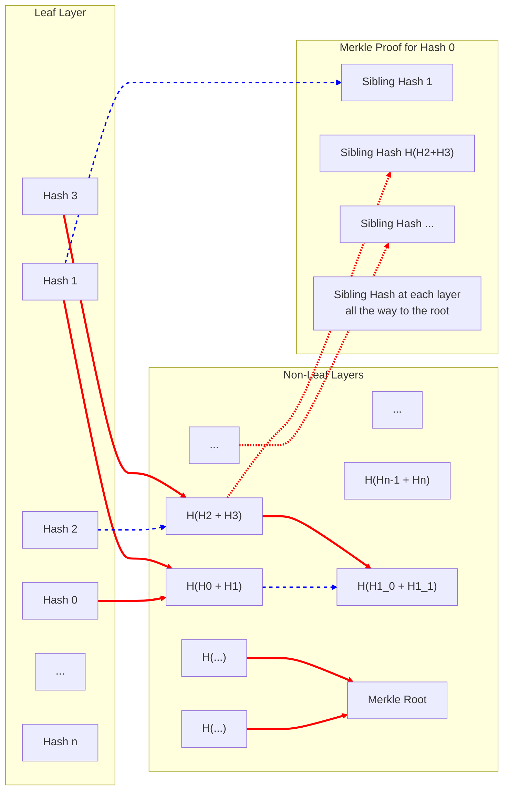

# Cryptography

## Pedersen Commitments (Perfect Secrecy)

```mermaid
graph LR
    A[Secret s] --> B[Commitment: c]
    B <--> C[Alice checks: c]
    D[Random r] --> B
    B --> E[Perfect Secrecy: c reveals no info about s]
    A -.-> C
    style B fill:#1b0d33,stroke:#333
    style C fill:#0d3323,stroke:#333,color:#fff
```



```math
c = g^s * h^r
```

## Key Pairing

## Sinsemilla

### HashDomain

### CommitDomain

## Proof-Input Serialization

## Halo2-Circuit Field

## Proof Circuit Key & Witness Proof Verification

## Recursive Proofs: pallas:: Curves

<!-- 
```mermaid
flowchart TD
    %% -------------------------------------------------
    %% 1. Key & Message Prep (deterministic data)
    %% -------------------------------------------------
    subgraph A[Key & Message Preparation]
        direction TB
        G["$$g$$"] -> PK["$$pk = g^{sk}$$"]
        M["$$m$$"] -> HT["$$h = HTC([m, sec1(pk)])$$"]
        SK["$$(sk, pk)$$"] -> PK
        Sec1["$$sec1(pk)$$"] -> HT
        SK -> Sec1     
    end

    %% =================================================
    %% 2. Signature Generation (deterministic + randomness)
    %% =================================================
    subgraph B[Signature Generation – PLUME V2]
        direction TB
        R["$$r$$"] -> GR["$$g^{r}$$"]
        HT -> H["$$h$$"]
        H -> Z["$$z = h^{r}$$"]
        SK -> Nul["$$nul = h^{sk}$$"]
        Nul -> C1["$$c = H([nul, g^{r}, z])$$"]
        R -> C1
        Z -> C1
        SK -> S1["$$s = r + sk·c$$"]
    end

    %% -------------------------------------------------
    %% Signature node (outside the generation sub‑graph)
    %% -------------------------------------------------
    Sig["signature = $$(z, s, g^{r}, c, nul)$$"]
    Z  -> Sig
    S1 -> Sig
    GR -> Sig
    C1 -> Sig
    Nul-> Sig

    %% -------------------------------------------------
    %% 3. ZK‑SNARK Proving (circuit)
    %% -------------------------------------------------
    subgraph C[ZK‑Proof Generation]
        direction TB
        PrivIn["Private Inputs:• pk<br/>• r<br/>• s<br/>• H(m,g^sk)"] -> Constraints
        PubIn["Public Inputs:<br/>• nul<br/>• c<br/>• g^r<br/>• z"] -> Constraints
        Constraints["Constraints:<br/>· g^s·pk⁻ᶜ = g^r<br/>· h^s·nul⁻ᶜ = z"] -> Proof["Proof $$(π, signature)$$"]
    end

    %% -------------------------------------------------
    %% 4. Verifier Checks
    %% -------------------------------------------------
    subgraph D[Verification]
        direction TB
        Proof -> VerifySNARK["✓ zk‑SNARK verifier"]
        PubIn -> ExtraCheck["✓ c == H([nul, g^r, h^r])"]
        VerifySNARK -> Final["Ownership Verified"]
        ExtraCheck -> Final
    end

    %% -------------------------------------------------
    %% Connections between phases
    %% -------------------------------------------------

    GR -> Constraints
    H -> Constraints
    Nul -> PubIn
    C1 -> PubIn
    Z -> PubIn
    G -> PubIn
    Sig -> Proof

    style A fill:#093b27,stroke:#5a9,stroke-width:2px
    style B fill:#09253b,stroke:#5a9,stroke-width:2px
    style C fill:#0b093b,stroke:#5a9,stroke-width:2px
    style D fill:#116066,stroke:#5a9,stroke-width:2px

```
  -->

## HKDF + Pallas

## Commit Merkle Tree


