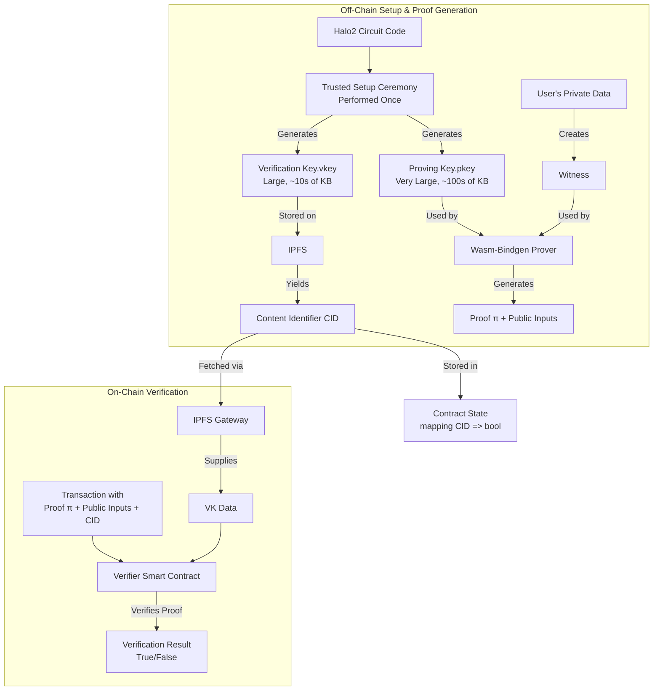

# Charcute: Trustless & Scalable Orchestration Framework

## Versioning

### Verifying What You Are Using On Your Device

### Reviewing Centralization Surface Area

### Communicating Fees

## Permissionless Specs

### Developing

### Compiling

### Deployment

### Publishing

### Interacting

### Proof Verification

