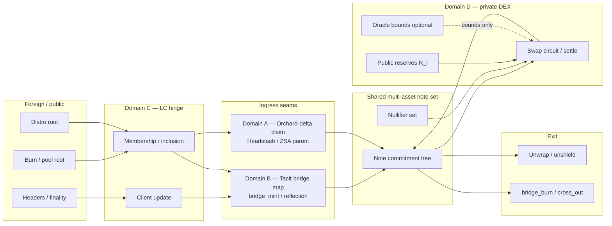

# FLOW — Private bridge authentication (compose Domains A–D)

> **Status (2026-07-20):** SPECs A–D **landed**. **Pure fixture crates** cover Domain **B** bridge auth and Domain **D** DEX/oracle seams (no halo2):  
> `docs/plans/spectrum/fixtures/bridge_auth_seams`, `docs/plans/spectrum/fixtures/private_dex_seams`.  
> Pre-e2e seam freeze: [`SEAM-FREEZE-CHECKLIST.md`](./SEAM-FREEZE-CHECKLIST.md).  
> **`SEAM-NOTE-OUT` path:** [`SEAM-NOTE-OUT.md`](./SEAM-NOTE-OUT.md) **frozen** (structural `SeamNoteOutV0`; A §6.1 H6 / B mint / D §1.1) — required before full C0–C9 e2e; pure B/D + A Part T may green first.
>
> **One-liner:** Foreign finalized state is **LC-proven**, value enters the shared note world via **Tacit-class conservation** (or Headstash claim into the same set), optionally **privately swaps** under public AMM + optional oracle **bounds**, then **exits** by burn / unshield — every step with an explicit **authentication checklist**.
>
> **Clarity:** Additive Headstash privacy sets + burn/mint vs escrow (incl. ZEC-out and Bitcoin↔Zcash IBC north star) → [`CLARITY-headstash-sets-and-bridge-models.md`](./CLARITY-headstash-sets-and-bridge-models.md).

> **Compose rule:** Objects stay independent; they unify only through **action seams** (msgs, proofs, LC updates, note fields). This document is the integrator: it names seams, verifiers, and failure modes so Domains A–D can ship in parallel and still compose deterministically.

---

## 0. Status of sibling SPECs

| Domain | Artifact | Status | Primary anchors for this FLOW |
|--------|----------|--------|-------------------------------|
| **A** | `SPEC-airdrop-orchard-delta.md` | **landed** (+ §1.10 additive sets design) | §1 claim model · §1.10 H7/H8 design · §4 delta · §4.1 claim interface · §5 seams · §6 H1–H6 |
| **B** | `SPEC-tacit-bridge-mapping.md` | **landed** | §3 mapping table · §4 deterministic auth · §5 domain/`asset_id` · §6 bridge tests · §9 mint packet checklist |
| **C** | `SPEC-lc-hinge-private-bridge.md` | **landed** | §0 taxonomy · §2 ClientState/Update/Membership · §3 hinge table · §4 lag/misbehaviour · §5 LC tests · §6 interface to A/B · §9 mint gate quick ref |
| **D** | `SPEC-private-dex-seams.md` | **landed** | §1 note I/O · §2 AMM · §3 oracle bounds · §4 same-set seams · §6 swap tests |
| **E** | this file + test matrix + SEAM freeze checklist | **this document** | composes A–D via `SEAM-*` |
| **B pure** | `fixtures/bridge_auth_seams` | **exists** | conservation, burn≠spend, domain bind (T1–T7-class) |
| **D pure** | `fixtures/private_dex_seams` | **exists** | swap math, oracle bounds, nullifier / wrong asset |
| **SEAM freeze** | `SEAM-FREEZE-CHECKLIST.md` | **active** | ownership + pre-e2e gates; `SEAM-NOTE-OUT` first |

Do **not** fork note language away from Tacit without a PLAN decision-log entry. If A–D and this FLOW disagree on a seam field, prefer the owning domain SPEC and open a compose issue here.

---

## 1. One-page architecture

### 1.1 End-to-end path (ASCII)

```text
  FOREIGN CHAIN / PUBLIC DISTRO              TRANSPARENT SPINE                 PRIVATE TERP SET
  ─────────────────────────────              ─────────────────                 ────────────────

  [headers / finality] ──┐
  [pool root / burn set]─┼──► LC UPDATE ──► client tip, height, lag ──┐
  [distro Merkle root]  ─┘     (Domain C)                             │
                                                                      ▼
                                                            ┌─────────────────────┐
  Tacit reflection-class burn ──(Domain B mapping)────────► │  AUTHENTICATED MINT │
  Headstash eligibility leaf ───(Domain A claim)──────────► │  / CLAIM → NOTE     │
                                                            │  same anonymity set │
                                                            └──────────┬──────────┘
                                                                       │ note (asset_id, C, ν material)
                                                                       ▼
                                                            ┌─────────────────────┐
                                           optional ───────►│  PRIVATE DEX SWAP   │ (Domain D)
                                           oracle mid       │  public R_i, fees   │
                                           bounds only      │  private Δ amounts  │
                                                            └──────────┬──────────┘
                                                                       │ note' (maybe new asset_id)
                                                                       ▼
                                                            ┌─────────────────────┐
                                                            │  EXIT               │
                                                            │  unshield / bridge_ │
                                                            │  burn → foreign     │
                                                            └─────────────────────┘

  HARD RULE: oracles / VEs bound quotes only — never mint balances.
```

### 1.2 Mermaid (seams)



### 1.3 Privacy ↔ transparency spectrum (this flow)

| Revealed (must be authenticatable) | Hidden (must remain private) |
|------------------------------------|------------------------------|
| LC client tip / height / confirmation depth | Note lineage across claim → swap → exit |
| Distro root / burn id / pool root (as public inputs) | Eligibility address ↔ claim recipient link |
| Pair id, public reserve deltas, fee params | Who traded; private I/O amounts (v1) |
| Oracle mid + staleness (if used for bounds) | Oracle never appears as a mint source |
| Nullifier presence on spend (spent-ness) | Which note commitment was spent |

---

## 2. Step-by-step flow

Canonical story (bridge path):

```text
foreign state → LC prove → note mint (bridge_mint) → [optional swap] → exit (burn / unshield)
```

Parallel ingress (airdrop path, same set):

```text
public distro → (optional LC/root freeze) → private claim → [optional swap] → exit
```

Both paths **must** land notes that Domain D and exit can spend without a second anonymity island.

### Step index

| Step | Name | Primary domain | Optional? |
|------|------|----------------|-----------|
| S0 | Preconditions & domain binding | B + C + program | no |
| S1 | Foreign state observation | C (+ B source defs) | no (bridge) / n/a claim-only |
| S2 | Light-client update & finality gate | C | no (bridge); soft for local claim |
| S3 | Authenticated mint / claim → note | B or A | no (one of them) |
| S4 | Optional private swap | D | yes |
| S5 | Exit (unshield / bridge_burn) | B + notes | path-dependent |
| S6 | Post-conditions & conservation audit | E compose | no |

---

### S0 — Preconditions & domain binding

**Intent:** Freeze the identity of assets, chains, and verifier keys so every later proof binds to the same universe.

| Item | Detail |
|------|--------|
| **Public inputs** | `chain_id_src`, `chain_id_dst` (Terp), `asset_id` map (foreign denom / Tacit reveal → Terp `asset_id`), verifier key ids / circuit digests, domain separator string(s), optional `REFLECTION_CONFIRMATIONS`-class depth |
| **Private witnesses** | (none at chain level; off-chain config may hold issuer keys for ZSA-style issuance later — see `zsas.md`) |
| **Verifier** | Governance / deployment freeze + client software; later consensus params |
| **Tacit mirror** | Confidential pool multi-asset note + domain binding in reflection/SP1 public values (`SPEC-CONFIDENTIAL-POOL.md`, legacy mixer domain bind in `BRIDGE.md`) |
| **Sibling SPEC** | Domain B §5 domain/`asset_id` + §3.3 asset identity; Domain C §3.1 domain binding public inputs; Domain D §1.1 note fields |

#### Authentication checklist (S0)

| # | What is verified | By whom | Evidence |
|---|------------------|---------|----------|
| S0.1 | `asset_id` map is complete for assets in this flow | Deployer / program freeze | Mapping table in Domain B SPEC |
| S0.2 | Circuit / VK digests match intended release | Chain / CosmWasm store / registry | Code id + checksum |
| S0.3 | Domain separator binds (asset, network, pool instance) | All later verifiers (must re-check) | Fixed constants in circuit public inputs |
| S0.4 | Oracle module (if present) is **not** registered as a mint authority | Chain config review | No mint path from hashmerchant |

#### Failure modes (S0)

| Mode | Result |
|------|--------|
| Ambiguous `asset_id` | Reject deploy / reject mint (conservation ambiguity) |
| VK mismatch | All proofs fail closed |
| Oracle registered as minter | **Hard fail** program invariant (do not ship) |

---

### S1 — Foreign state observation

**Intent:** Identify the exact foreign object that will later authorize mint: burn record, pool root, header, or public distro leaf.

| Item | Detail |
|------|--------|
| **Public inputs** | Block/header hash or height, burn id / `cross_out` commitment, foreign pool root, distro Merkle root, confirmation depth claim |
| **Private witnesses** | Full Merkle path to burn/leaf (may stay with prover until S2/S3); raw foreign txs as needed for SP1/guest |
| **Verifier** | Not yet on Terp — observer/prover pipeline; authenticity is deferred to S2 |
| **Tacit mirror** | Reflection guest reads envelopes / burns; silent skip of malformed (fail closed for *that* claim, not panic) |
| **Sibling SPEC** | Domain C §1 inventory + §2 membership; Domain B §4.2 burn authenticity (H-1 class) |

#### Authentication checklist (S1)

| # | What is verified | By whom | Evidence |
|---|------------------|---------|----------|
| S1.1 | Observed object matches schema (burn amount, asset, recipient bind fields as designed) | Prover / indexer (liveness only) | Parsed structure |
| S1.2 | No soundness reliance on worker alone | Protocol design | S2 must re-prove from LC / headers |
| S1.3 | Claim path: eligibility leaf under published distro root | Claimant + later S3 circuit | Domain A vectors H1/H3 |

#### Failure modes (S1)

| Mode | Result |
|------|--------|
| Malformed foreign envelope | Drop claim; no mint |
| Stale observation (reorg below finality) | Must not pass S2 finality gate |
| Wrong asset tag on burn | Fail domain bind at S3 |

---

### S2 — Light-client update & finality gate

**Intent:** Advance Terp (or app) **client state** so foreign finality and inclusion are **publicly authenticatable**. LC is the hinge: without it, bridge mints devolve to attestors.

| Item | Detail |
|------|--------|
| **Public inputs** | Client id, header batch / consensus proofs, new client tip, `min_confirmations`, inclusion proof commitments (burn ∈ set, root ∈ state) |
| **Private witnesses** | Intermediate headers / signatures as required by LC type (Bitcoin work, Tendermint, 08-wasm custom); membership paths if not fully public |
| **Verifier** | **08-wasm / CosmWasm LC contract** or equivalent on-chain client; in-VM where applicable |
| **Tacit mirror** | `BitcoinLightRelay` + SP1 reflection confirmation ≥ `REFLECTION_CONFIRMATIONS`; Tier 0 reflection mint |
| **Sibling SPEC** | Domain C §2 per–LC-type update/membership · §3 hinge table · §4 degraded policy · §9 “what must verify before private mint?” |

#### Authentication checklist (S2)

| # | What is verified | By whom | Evidence |
|---|------------------|---------|----------|
| S2.1 | Header/work/validator set transition is valid per LC algorithm | LC contract | Update success event / new height |
| S2.2 | Claimed burn / root is included under client state at depth ≥ gate | LC membership verifier or paired hinge module | Inclusion proof verify |
| S2.3 | Client not frozen / not expired / not misbehaviour-halted | LC contract | Status query |
| S2.4 | Confirmation depth ≥ configured constant | LC + mint gate | Height math |
| S2.5 | (Optional) Crosslink/Zcash: shielded anchor membership as specified | LC hinge | Domain C section |

#### Failure modes (S2)

| Mode | Result |
|------|--------|
| Insufficient confirmations | Mint blocked (degraded / wait) |
| Misbehaviour evidence | Client freeze; mint path stops |
| Inclusion against wrong root | Reject membership |
| Clock / trusting period expired | Reject update / mint |

---

### S3 — Authenticated mint / claim → note

**Intent:** Create a note in the **shared multi-asset anonymity set** only when conservation + membership + domain bind hold. Two ingress flavors share one note language.

#### S3-B — Bridge mint (Tacit-threaded)

| Item | Detail |
|------|--------|
| **Public inputs** | LC tip binding, burn id / amount `v`, `asset_id`, new note leaf commitment, optional recipient bind hash, domain separator, nullifier registry key for burn (one-time) |
| **Private witnesses** | Note openings `(v, r)`, owner/recovery material, paths if circuit-internal |
| **Verifier** | Pool / bridge CosmWasm (or hybrid) + circuit verify (zk-cosmwasm multi-curve / SP1-class as chosen); **must** check LC gate from S2 |
| **Tacit mirror** | `bridge_mint`: confirmed burn → new note; `v_mint == v_burn`; burn set one-time (`SPEC-CONFIDENTIAL-POOL.md` §6) |
| **Sibling SPEC** | Domain B §3.1 bridge core · §4 deterministic auth · §9 mint packet checklist; Domain C §6.1 B interface · §6.3 shared mint gate |

#### S3-A — Headstash / Orchard-delta claim

| Item | Detail |
|------|--------|
| **Public inputs** | Distro root, claim nullifier, note commitment / action public outputs, amount or fixed drop unit, domain bind |
| **Private witnesses** | Eligibility leaf + Merkle path, note secrets, spend-auth style keys (Orchard-family), recipient diversifier |
| **Verifier** | `cw-headstash` / suite verify path (`crates/headstash`); in-VM Halo2 verify as integrated |
| **Upstream parent** | Slightly modified Orchard; multi-asset later via ZSA (`docs/plans/spectrum/zsas.md`) — bridges as issuers is a ZSA use case |
| **Sibling SPEC** | Domain A §1.4–§1.7 claim path · §4.1 claim interface · §5 seams · §6 H1–H6; Domain C §6.2 A interface (optional distro-root freeze) |

#### Authentication checklist (S3)

| # | What is verified | By whom | Flavor |
|---|------------------|---------|--------|
| S3.1 | Proof / action verifies under frozen VK | On-chain verifier | both |
| S3.2 | `v` conserved: mint ≤ proven foreign burn / eligibility credit | Circuit + contract | both |
| S3.3 | Burn id or claim nullifier **not previously used** | Nullifier / burn registry | both |
| S3.4 | `asset_id` matches domain-bound map from S0 | Contract | both |
| S3.5 | LC finality gate satisfied for this burn | Contract reads LC | **B only** |
| S3.6 | Distro root matches frozen / published root | Contract | **A only** |
| S3.7 | Note leaf appended; tree root updated consistently | Pool contract | both |
| S3.8 | Public inputs do **not** force link eligibility addr → recipient (property) | Circuit design + tests H5 | **A** |
| S3.9 | Output note fields match Domain D consumable schema (H6 / B map) | Structural tests | both |
| S3.10 | No oracle / VE signature required for mint | Design review | both |

#### Failure modes (S3)

| Mode | Result |
|------|--------|
| Double claim / double burn | Reject (nullifier / burn set) |
| Proof valid but LC lag | Reject until S2 green |
| Wrong root / wrong asset | Reject |
| Conservation break (`v_mint > v_burn`) | Reject (critical) |
| Note schema not DEX-consumable | Fail compose tests (E); block integration |

---

### S4 — Optional private swap (Domain D)

**Intent:** Spend note(s) of asset A, mint note(s) of asset B against a **public** AMM (Tacit CP / virtual reserves spirit). Privacy of amounts and identity; transparency of reserves and optional oracle **bounds**.

| Item | Detail |
|------|--------|
| **Public inputs** | Pool id / pair, reserve state `(R_in, R_out)` or multi-asset `R_i`, fee γ, `min_out` (or bound-derived), nullifiers of spends, new output commitments, optional `oracle_mid`, `max_slippage_bps`, anchor root |
| **Private witnesses** | Spend note openings, Merkle paths, output blindings, exact Δ_in / Δ_out |
| **Verifier** | DEX pool contract + swap circuit (conservation per asset + CP inequality / equality as specified) |
| **Oracle** | hashmerchant VE → mid + staleness; used only as \( \textit{min_out} \ge g(\textit{mid}, \textit{slippage}) \); **never** credits balances |
| **Tacit mirror** | Multi-asset transfer + SWAP settle; EVM confidential settle Tier 0 analog |
| **Sibling SPEC** | Domain D §1 note I/O · §2 AMM · §3 oracle bound API · §4.4–§4.5 composition · §6 swap_* tests |

Illustrative swap rule (match Tacit; freeze in Domain D):

\[
\Delta_{\text{out}} = R_B \cdot \gamma \cdot \Delta_{\text{in}} / (R_A \cdot \gamma_d + \gamma \cdot \Delta_{\text{in}})
\]

Circuit enforces relation (or ≥ `min_out`); contract applies public reserve Δ.

#### Authentication checklist (S4)

| # | What is verified | By whom |
|---|------------------|---------|
| S4.1 | Spend membership under current (or allowed) note root | Circuit + contract |
| S4.2 | Nullifiers fresh | Nullifier set |
| S4.3 | Range / no negative value | Circuit (BP+ / Halo2 range analog) |
| S4.4 | Per-asset conservation of private notes vs public reserve Δ | Circuit + contract |
| S4.5 | If oracle path: mid fresh, quorum/staleness OK, bound holds | Contract reads oracle; circuit may bind `min_out` |
| S4.6 | Oracle signature **cannot** increase user balance without S4.4 | Invariant tests |
| S4.7 | Fee params match pool config | Contract |

#### Failure modes (S4)

| Mode | Result |
|------|--------|
| Stale oracle / missing mid | Reject **bound path**; optional allow pure AMM path if policy says so |
| Slippage exceeded | Reject |
| Double-spend nullifier | Reject |
| Reserve desync (public vs proven Δ) | Reject settle |
| Attempted “oracle mint” | Reject; must appear in threat tests |

---

### S5 — Exit (unshield / bridge_burn)

**Intent:** Leave the private set either to transparent Terp payout or to a foreign chain via burn + later remote mint (inverse of S3-B).

#### S5-U — Unshield / unwrap

| Item | Detail |
|------|--------|
| **Public inputs** | Amount `v` (opening), payout address, nullifier, asset_id, root anchor |
| **Private witnesses** | Note secrets, path |
| **Verifier** | Pool contract + spend circuit |
| **Tacit mirror** | `unwrap` |

#### S5-B — bridge_burn / cross_out

| Item | Detail |
|------|--------|
| **Public inputs** | `cross_out` record (dest chain, amount, asset_id, bind fields), nullifier, domain separator |
| **Private witnesses** | Note openings / path |
| **Verifier** | Pool + burn circuit; later foreign LC uses this as S1 object |
| **Tacit mirror** | `bridge_burn` → other chain `bridge_mint` |

#### Authentication checklist (S5)

| # | What is verified | By whom |
|---|------------------|---------|
| S5.1 | Note membership + nullifier unique | Circuit + contract |
| S5.2 | Public payout / cross_out amount equals note `v` (opening) | Circuit + contract |
| S5.3 | Domain bind / dest chain id correct | Contract |
| S5.4 | Backing / escrow decrement matches `v` (solvency) | Contract accounting |
| S5.5 | Burn id one-time for remote mint consumption | Burn registry |

#### Failure modes (S5)

| Mode | Result |
|------|--------|
| Under-backed unwrap | Reject (INV conservation) |
| Replay burn | Reject |
| Wrong dest domain | Reject |

---

### S6 — Post-conditions & conservation audit

**Intent:** Compose-level checks that no step invented value and privacy claims match honesty tables.

| Check | Meaning |
|-------|---------|
| **Global conservation** | Σ foreign burns in + claims credited = Σ notes unspent value + unshielded out + burns out (± fees explicitly accounted) |
| **Nullifier uniqueness** | No ν used twice across claim, swap, exit |
| **Domain binding** | No cross-asset or cross-pool proof replay |
| **Oracle non-authority** | Full path green with oracle halted still conserves; oracle cannot create notes |
| **Unlinkability story** | Public transcript does not prove claim leaf = swap nullifier = exit (beyond anonymity set) |

#### Authentication checklist (S6)

| # | What is verified | By whom |
|---|------------------|---------|
| S6.1 | Property / integration tests of conservation | Compose harness (Domain E matrix) |
| S6.2 | Trust tier labels match Tacit (`TRUST-TIERS-AND-CONVERGENCE.md`) | Human review + docs |
| S6.3 | Sibling SPECs’ interfaces match this FLOW’s seams | Domain owners + E |

---

## 3. Per-step summary table

| Step | Public inputs (summary) | Private witnesses (summary) | Verifier | Critical failures |
|------|-------------------------|----------------------------|----------|-------------------|
| S0 | asset map, VK ids, domain sep | — | deploy / governance | wrong bind |
| S1 | headers, burn/root ids | paths, raw txs | observer (non-final) | malformed / reorg |
| S2 | client update, inclusion | LC-specific | LC contract | lag, misbehaviour |
| S3 | burn/claim pubs, note cm, ν | openings, paths, keys | pool + circuit | double-mint, cons. |
| S4 | reserves, nfs, outs, bounds | spends, Δ, paths | DEX + circuit | slip, double-spend |
| S5 | payout/cross_out, ν | spend secrets | pool + circuit | insolvency, replay |
| S6 | aggregates / transcripts | — | compose tests | invented value |

---

## 4. Global invariants

These are **program-level**. Every domain SPEC must restate the ones it enforces; compose tests own the cross-seam versions.

### I1 — Conservation (solvency)

> No authenticatable path may create value. Mints require proven foreign burn, eligibility credit, or explicit fee/governance mint **outside** this private bridge flow.  
> **Tacit:** kernel / per-asset conservation; `v_mint == v_burn` for reflection.

### I2 — Nullifier uniqueness

> Each spend/claim nullifier (and each burn id) is consumed **at most once** in its registry domain.  
> Chain-independent ν (Tacit) is the design target for cross-lane; Terp may stage single-chain ν first if documented.

### I3 — Domain binding

> Proofs bind to `(asset_id, pool/instance, chain/network, circuit VK)`. Replay across pools or assets must fail.

### I4 — Oracle non-authority

> hashmerchant / vote extensions supply **price bounds only**. They MUST NOT appear as `MsgMint`, note credit, or reserve inflation sources.  
> Analog: Tacit cUSD (oracle-priced) vs cBTC (conservation peg) honesty — this flow’s bridge path is **conservation-class**.

### I5 — Shared anonymity set

> Headstash claim outputs and bridge_mint outputs MUST be spendable in the **same** note set as DEX swaps (no privacy island).

### I6 — LC honesty

> Bridge mint authorization is a function of **LC-authenticated** foreign state, not worker attestation alone. Workers may provide liveness (paths, hints).

### I7 — Fail closed

> Malformed proofs, stale LC, bad oracle (when required), and registry collisions **reject**. Silent skip is allowed only for *unrelated* foreign noise (Tacit guest pattern), never for “accept partial mint.”

### I8 — Trust tier honesty

> Do not label a Terp feature Tier 0 if the Tacit analog is Tier 1 without a documented prove path (`TRUST-TIERS-AND-CONVERGENCE.md`).

---

## 5. Action seams (interface contracts)

Compose only through these seams. Field names are **placeholders** until Domains A–D freeze them — names chosen to match expected SPEC sections.

| Seam ID | From → To | Payload (conceptual) | Owner freeze (SPEC anchor) |
|---------|-----------|----------------------|----------------------------|
| `SEAM-LC-STATE` | C → B/A | `client_id`, tip height, roots, lag, status | C §2–§3, §9 |
| `SEAM-BURN-WITNESS` | B/C → B | burn id, `v`, asset, inclusion under LC | B §4.2 + C §2 membership / §3 hinge |
| `SEAM-DISTRO-ROOT` | A/gov → A | public distribution root + params | A §1.6, §4.1 |
| `SEAM-NOTE-OUT` | A/B → D/E | `SeamNoteOutV0` (see `SEAM-NOTE-OUT.md`) | **`SEAM-NOTE-OUT.md`**; A §6.1 H6; B §3.1; D §1.1 |
| `SEAM-SPEND` | D/E → notes | nullifier, anchor root, proof | D §1.2 swap I/O |
| `SEAM-AMM-STATE` | D public | `R_i`, fees, pool id | D §2 |
| `SEAM-ORACLE-BOUND` | hashmerchant → D | mid, timestamp, sources, quorum | D §3 (hard rule §3.1) |
| `SEAM-CROSS-OUT` | E exit → foreign S1 | burn record for reverse path | B §3.1 `bridge_burn` map |
| `SEAM-DOMAIN-SEP` | S0 → all | domain bind bytes | B §5; C §3.1 |

**Rule:** If a domain needs data not on a seam, it either extends a seam in its SPEC or the change is rejected (no god-state).

---

## 6. Master test matrix (compose / seams only)

> Full named cases live in [`FLOW-private-bridge-auth-test-matrix.md`](./FLOW-private-bridge-auth-test-matrix.md).  
> Domain unit tests (H1–H6, LC unit, AMM unit) stay in A–D; **E only checks seams and e2e auth**.

| Suite | Focus | Pass means |
|-------|--------|------------|
| **C0** | Happy path bridge → note → exit | Conservation holds; all checklists green |
| **C1** | Happy path claim → note → swap → exit | Same set; reserves move; unlinkability smoke |
| **C2** | Double-spend / double-claim / double-burn | Second attempt rejected at registry |
| **C3** | LC lag / insufficient confirmations | Mint blocked; no note |
| **C4** | Wrong domain / wrong asset_id | Proof or contract reject |
| **C5** | Oracle halt / stale mid | Bound-path swap rejects; conservation intact; no mint via oracle |
| **C6** | Oracle cannot mint | Explicit adversarial: oracle-signed credit without burn/claim fails |
| **C7** | Schema mismatch `SEAM-NOTE-OUT` | DEX rejects non-consumable claim/bridge note |
| **C8** | Reverse path burn → foreign | `SEAM-CROSS-OUT` parseable as S1 object (stub OK) |
| **C9** | Trust tier labels | Doc/fixture assertion only (no fake Tier 0) |

Harness philosophy (playbook): tests may be **red** until domain objects land; compose suite names are frozen here.

Suggested future commands (adjust when crates exist):

```bash
# placeholder — replace with real package paths after integrate sprints
cargo test -p terp-private-bridge-compose --test seams
cargo test -p terp-private-bridge-compose --test e2e_auth
```

---

## 7. Parallel team ownership map

| Step / seam | Domain A Headstash/Orchard/ZSA | Domain B Tacit bridge map | Domain C LC hinge | Domain D Private DEX | Domain E Compose |
|-------------|-------------------------------|---------------------------|-------------------|----------------------|------------------|
| S0 domain bind | asset tags for drop | **owns map** | client ids | pool ids | checklist |
| S1 foreign observe | distro leaf schema | burn schema | **observe API** | — | — |
| S2 LC update | — | reflection confirm constants | **owns** | — | C3 tests |
| S3 mint/claim | **S3-A owns** | **S3-B owns** | gate read | consumes note | C0/C1/C2 |
| S4 swap | — | — | — | **owns** | C1/C5/C6 |
| S5 exit | — | **burn/unwrap map** | reverse LC later | — | C0/C8 |
| I1–I8 invariants | restate claim | restate mint | restate LC | restate swap | **compose audit** |
| `SEAM-NOTE-OUT` | emit | emit | — | consume | structural C7 |
| Oracle | — | — | — | bounds only | C5/C6 |

**Non-interference:** Agents write **only** their SPEC/FLOW files (dispatch rule). Code landings follow sprint cards after SPEC freeze.

---

## 8. Definition of “fully curated” (this flow)

The private bridge path is **fully curated** when **all** of the following are true:

### 8.1 Spec completeness

- [x] Domains A–D SPECs exist at the paths in the YAML header
- [x] This FLOW cites SPEC section anchors ( Domains A–D landed 2026-07-20 )
- [ ] `SEAM-*` payloads have concrete field types and encodings (merge A §4.1 + B §9 + D §1 into one encoding doc or freeze in compose vectors)
- [ ] Note schema single-sourced (Tacit-aligned); Orchard-delta table committed — A §4 exists; cross-check vs D §1.1 still open
- [ ] Trust tier table filled per step (0/1/2) with honest labels — use B §2 + C taxonomy + D §8.3

### 8.2 Authentication completeness

- [ ] Every step S0–S6 has a non-empty authentication checklist
- [ ] Each checklist item names **what**, **who verifies**, **evidence**
- [ ] No step relies on worker soundness without LC or on-chain verify (I6)

### 8.3 Invariants & threats

- [ ] I1–I8 restated in each owning SPEC
- [ ] Explicit “oracle cannot mint” adversarial case green
- [ ] Double-spend / double-claim / wrong domain cases green
- [ ] Privacy honesty table (revealed vs hidden) reviewed

### 8.4 Tests & harness

- [ ] Domain unit scenarios exist (e.g. H1–H6, LC, AMM)
- [ ] Compose matrix C0–C9 implemented (may live as vectors first)
- [ ] Harness commands documented with date + result (playbook progression grade)
- [ ] Red→green history not required for “curated specs”; required for “progression-grade software”

### 8.5 Assignability

- [ ] Ownership map (§7) uncontested
- [ ] Implementation order (§9) accepted
- [ ] Out-of-scope list clear: no Tachyon/Ragu required for curated v1 flow; ZSA multi-asset issuance may remain parent-ref until later

**Curated ≠ shipped.** Curated means a new agent can implement without inventing seams.

---

## 9. Recommended implementation order (after SPECs land)

Follow program phases (PLAN §7) but **ordered for this auth flow**:

| Order | Work | Domain | Why first |
|------:|------|--------|-----------|
| 1 | Freeze `SEAM-NOTE-OUT` + Orchard-delta claim fields | A (+ notes) | Everything spends notes |
| 2 | Freeze Tacit `bridge_mint`/`burn` ↔ Terp msg map + `asset_id` | B | Conservation language |
| 3 | LC hinge: update + inclusion gate API | C | Auth for bridge mint |
| 4 | Green S3-A path (claim → note) unit | A | Local demo without LC |
| 5 | Green S3-B path (LC → mint) unit | B+C | Bridge authenticity |
| 6 | DEX seams: spend + AMM public state | D | Optional swap |
| 7 | Oracle bounds interface (fail closed) | D + HM | Non-authority tests |
| 8 | Exit unshield + bridge_burn | B | Round-trip |
| 9 | Compose C0–C9 harness | E | Full curation evidence |
| 10 | Privacy upgrade batch sealed swaps | D / phase 2 | After v1 settle green |
| 11 | ZSA asset id / issuance alignment | A parent | When multi-asset issuance is the bottleneck |
| 12 | Tachyon/Ragu recursion | later | When proof aggregation is the bottleneck |

**Do not** start Tachyon/Ragu or full ZSA issuance to “complete” this FLOW.

---

## 10. Threat notes (compose-level)

| Threat | Mitigation in flow |
|--------|-------------------|
| Prover lies about foreign burn | S2 LC inclusion + finality; mint gated |
| Replay mint on second chain | Burn registry + domain bind + ν design |
| Eligibility sold / linked | S3-A private claim; H5 property; shared set |
| Oracle bribery | Bounds only; AMM conservation independent |
| VK / circuit swap | S0 freeze + on-chain code id |
| Privacy theater (split sets) | I5 + C7 schema tests |
| Fake Tier 0 marketing | I8 + C9 |

---

## 11. References (absolute monorepo paths)

| Path | Role |
|------|------|
| `/Users/returniflost/abstract/terp-core/crates/tacit/spec/SPEC-CONFIDENTIAL-POOL.md` | Note, ops, bridge_mint/burn |
| `/Users/returniflost/abstract/terp-core/crates/tacit/spec/design/TRUST-TIERS-AND-CONVERGENCE.md` | Tier honesty |
| `/Users/returniflost/abstract/terp-core/crates/tacit/BRIDGE.md` | Legacy mixer bridge; sunset lessons |
| `/Users/returniflost/abstract/terp-core/crates/tacit/AMM.md` | Confidential AMM architecture |
| `/Users/returniflost/abstract/terp-core/crates/tacit/MIXER.md` | Fixed-denom anonymity lessons |
| `/Users/returniflost/abstract/terp-core/crates/headstash/` | Claim circuit + `cw-headstash` |
| `/Users/returniflost/abstract/terp-core/docs/plans/spectrum/zsas.md` | ZIP 227 issuance parent |
| `/Users/returniflost/abstract/terp-core/docs/plans/spectrum/SPEC-airdrop-orchard-delta.md` | Domain A (landed) |
| `/Users/returniflost/abstract/terp-core/docs/plans/spectrum/SPEC-tacit-bridge-mapping.md` | Domain B (landed) |
| `/Users/returniflost/abstract/terp-core/docs/plans/spectrum/SPEC-lc-hinge-private-bridge.md` | Domain C (landed) |
| `/Users/returniflost/abstract/terp-core/docs/plans/spectrum/SPEC-private-dex-seams.md` | Domain D (landed) |
| `/Users/returniflost/abstract/terp-core/docs/plans/spectrum/FLOW-private-bridge-auth-test-matrix.md` | Compose tests |
| Program PLAN / playbook (vault) | `plans/terp-private-shielded-dex-bridge/` |

---

## 12. Changelog

| Date | Change |
|------|--------|
| 2026-07-20 | Initial Domain E compose FLOW: architecture, S0–S6 with auth checklists, invariants, seams, ownership, curated definition, impl order |
| 2026-07-20 | Wired A–D SPEC section anchors after parallel domain SPECs landed |
| 2026-07-20 | Status: pure B/D fixture crates + SEAM-FREEZE-CHECKLIST / SEAM-NOTE-OUT pre-e2e path |

---

## 13. Exit criteria for Domain E session

- [x] Single FLOW document at `docs/plans/spectrum/FLOW-private-bridge-auth.md`
- [x] Architecture diagram (ASCII + mermaid)
- [x] Step flow foreign → LC → note → optional swap → exit
- [x] Per-step public / private / verifier / failures + **auth checklists**
- [x] Global invariants including oracle non-authority
- [x] Master test matrix (summary here + full optional file)
- [x] Ownership map A–E
- [x] Fully curated checklist
- [x] Implementation order post-SPEC
- [x] Sibling paths referenced; marked pending when absent
