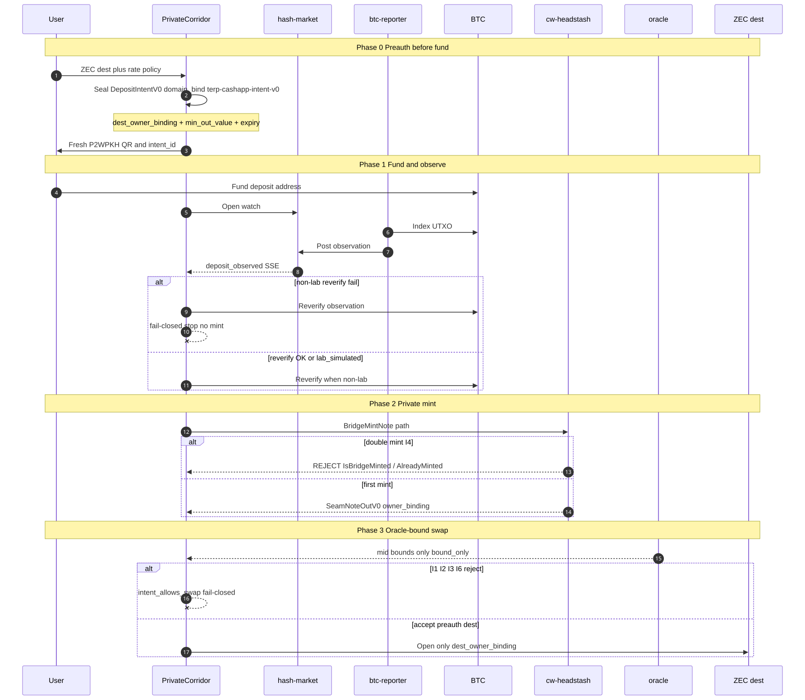

# Workflows and semantic graphs

This chapter holds the corridor’s **sequence, layers, profiles, and Trailmark-derived call graph** — the visual index for Private Bridge product docs.

## Product workflow (sequence)

Phases in order: preauth **before** fund → observe → private mint → oracle-bound swap (`bound_only`) → preauth dest only.



Source: [`workflow-cashapp-corridor.mmd`](../diagrams/mmd/workflow-cashapp-corridor.mmd)  
(style: [crypto-protocol-diagram](../../../../../../crates/tob-skills/plugins/trailmark/skills/crypto-protocol-diagram/SKILL.md) — parties, phases, reject paths)

### Mermaid source (for live preview)

```mermaid
{{#include ../diagrams/mmd/workflow-cashapp-corridor.mmd}}
```

## Layer map



```mermaid
{{#include ../diagrams/mmd/workflow-layers.mmd}}
```

## Profiles (lab ≠ funded ≠ production)


```mermaid
{{#include ../diagrams/mmd/workflow-profiles.mmd}}
```

| Profile | Observe | Mint | UI reverify |
|---------|---------|------|-------------|
| `lab_simulated` | Synthetic OK | `mock_verify` OK | Lab banner |
| `ict_local_funded` | Regtest + `corridor-btc-reporter` | Daemon `BridgeMintNote` | Fail-closed |
| `production` | Self-hosted / approved index | Deploy proof policy | Fail-closed; no lab banner |

**Invariant:** same workflow shape across profiles. Labels, observe surface, and mint proof policy change — not a separate lab-only product fork.

## Trailmark: cashapp_zec_corridor call graph

Parsed with **Trailmark** (`trailmark analyze` + `diagramming-code`), then rendered to SVG.

| Metric | Value (fixture) |
|--------|-----------------|
| Nodes | 42 |
| Functions | 28 |
| Call edges | 139 |
| Deps | `std`, `sha2` |



Focused Mermaid (Trailmark-informed): [`trailmark-cashapp-core.mmd`](../diagrams/mmd/trailmark-cashapp-core.mmd)  
Full raw export (depth-3, may need sanitizing before `mmdc`): [`trailmark-cashapp-call-graph.mmd`](../diagrams/mmd/trailmark-cashapp-call-graph.mmd)

Key pure functions to read first:

| Symbol | Role |
|--------|------|
| `DepositIntentV0::new_preauth` | Seal dest + bounds before fund |
| `DepositIntentV0::compute_domain_bind` | Intent integrity under `terp-cashapp-intent-v0` |
| `intent_allows_swap` | I1–I6 swap policy gate (dense branch set) |
| `CorridorMintedSet::authorize_mint` | Double-mint reject |
| `oracle_mint_forbidden` | Oracle never mints (`bound_only`) |

## How to regenerate

See [diagrams README](../diagrams/README.md). Prefer Trailmark when the question is “what does the code call?” Prefer crypto-protocol sequence diagrams when the question is “who sends what to whom under which crypto?”
