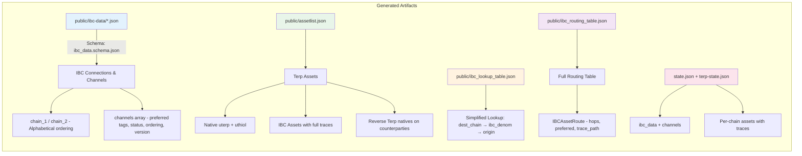
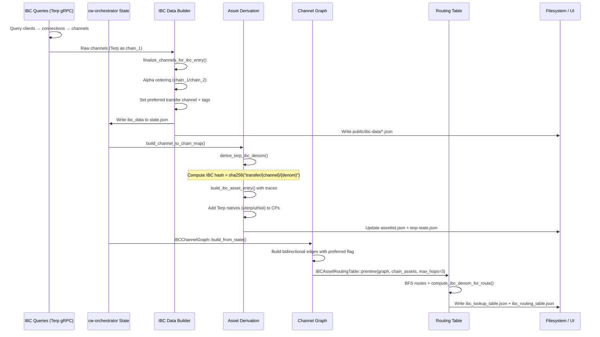

# Terp Network Test Suite

Date: 2026-06-12

---

## What this workspace is

`tests/` is the Terp Network integration, schema validation, and IBC asset derivation workspace.  
**Package name: `terp-scripts`** (in `Cargo.toml`). Path is `tests/`; package is not named “tests”.

**Agents: read [`agent/COMMANDS.md`](agent/COMMANDS.md) first.** Prefer `just scripts-ibc-*` from the workspace root.

### Capabilities

1. **IBC info derivation** — `bin/ibc_info.rs` (`cargo run -p terp-scripts --bin terp-ibc`):
   - **Live** `generate` — query chains, write repo-root `public/` artifacts
   - **Offline** `validate` / `compare` / `rebuild-from-public` / `preflight` — JSON `RunReport`, exit codes 0/1/2
   - Artifacts: `public/ibc-data/*.json`, `assetlist.json`, routing + lookup tables
2. **Contract deployment** — suite modules (feature-gated)
3. **Sidecar lifecycle** — off-chain services for integration tests
4. **Multi-chain IBC authenticity harness** — `#[ignore]`d 4-chain line Docker test (`tests/ibc_multihop_harness.rs`)

---

## Architecture

```
tests/                          # package: scripts
├── agent/COMMANDS.md           # Agent catalog (load first)
├── src/
│   ├── lib.rs
│   ├── report.rs               # RunReport (agent JSON)
│   ├── environments/
│   ├── ibc/                    # Pure authenticity lib (predict/observe/diff/publish)
│   └── ibc_core.rs             # Legacy re-export surface
├── bin/
│   ├── ibc_info.rs             # bin: ibc — CLI contracts + live generate
│   ├── e2e.rs
│   └── …
├── tests/
│   ├── ibc_unit.rs
│   ├── ibc_golden.rs
│   ├── ibc_multihop_harness.rs
│   └── nostr_orch_suite.rs
├── data/ibc/                   # golden / harness fixtures
└── Cargo.toml
```

Generated artifacts live at **repo-root** `public/` (not `tests/public/`).

---

## The IBC info pipeline (`bin/ibc_info.rs`)







```sh
# Always -p terp-scripts; prefer just from workspace root
cargo run -p terp-scripts --bin terp-ibc -- preflight --mode offline --format json
cargo run -p terp-scripts --bin terp-ibc -- validate --format json
cargo run -p terp-scripts --bin terp-ibc -- rebuild-from-public --format json
cargo run -p terp-scripts --bin terp-ibc -- generate --mode live-query   # needs MAIN_MNEMONIC
```

### What it generates

| File | Schema | Contents |
|------|--------|----------|
| `public/ibc-data/{a}-{b}.json` | `ibc_data.schema.json` | IBC channels, clients, connections per chain pair |
| `public/assetlist.json` | `asset_list.schema.json` | Native Terp assets + chain-registry base denoms + derived IBC assets |
| `public/ibc_routing_table.json` | (internal) | All multi-hop routes from BFS graph traversal |
| `public/ibc_lookup_table.json` | (simplified) | IBC denom → symbol/origin/trace lookup |

### Schema compliance

All output files are validated against the canonical chain-registry JSON schemas in `public/`:
- `asset_list.schema.json` — enforces required fields (`denom_units`, `type_asset`, `base`, `display`, `name`, `symbol`), trace type enums (`ibc`, `ibc-cw20`, `bridge`, ...), channel_id patterns (`^channel-\d+$`), `$schema` pointer
- `ibc_data.schema.json` — enforces `ordering` as `"ordered"|"unordered"` string (not int), `chain_1`/`chain_2` with `chain_name`/`chain_id`/`client_id`/`connection_id`, `tags` with `preferred`/`status`

---

## Core derivation module (`src/ibc_core.rs`)

Pure functions operating on state.json data — no chain dependency, usable in unit tests:

```rust
compute_ibc_denom_hash("transfer/channel-1/uakt")
// → "ibc/1480B8FD20AD5FCAE81EA87584D269547DD4D436843C1D20F15E00EB64743EF4"

IBCChannelGraph::build_from_state(&ibc_data)       // adjacency list from ibc_data entries
graph.find_routes("terp", "akash", 3)               // BFS with hop limit
graph.compute_ibc_denom_for_route("uakt", &route)   // denom from route
IBCAssetRoutingTable::premine(&graph, &assets, 4)   // all routes for all assets
```

---

## Offline tests (no Docker)

```sh
cargo test -p terp-scripts --lib --test ibc_unit --test ibc_golden
# or: just scripts-ibc-offline
```

- `tests/ibc_unit.rs` — pure hash, normalize, prefer-direct, schema
- `tests/ibc_golden.rs` — golden fixtures under `data/ibc/golden/`
- There is **no** `tests/tests/ibc_info.rs` (removed / never shipped as claimed)

---

## Multi-chain IBC authenticity harness (Docker, ignored)

**Implemented, not claimed green in CI.** Live proof lives in:

- Test: [`tests/tests/ibc_multihop_harness.rs`](tests/ibc_multihop_harness.rs) — `test_line_four_chain_tokenfactory_multihop`
- Notes: [`data/ibc/harness/README.md`](data/ibc/harness/README.md)

Topology: line **A—B—C—D** (`terp-a`…`terp-d`), Hermes links only on adjacent pairs, 16 tokenfactory denoms (4 per chain), scenarios 1–6 hop-by-hop ICS-20. Pass means **predict == denom_trace == bank balance denom**.

```sh
cargo test -p terp-scripts --test ibc_multihop_harness -- --ignored --nocapture
```

Requires Docker and a Terp image (default `terpnetwork/terp-core:local-zk`, overridable via `ICT_IMAGE_*` / `TERP_IMAGE_*`). There is no `tests/tests/ibc_info.rs` multichain test; offline schema/derivation coverage is separate from this harness.

Pure path/hash helper checks in the same file run without Docker (not ignored).

---

## How to run

### Prerequisites

```sh
# Sidecar binaries
cargo build --bin hash-market-server -p hash-market --features "server,ve,blossom"
cargo build --bin hash-market-client -p hash-market --features "client"

# Docker images (for integration tests)
docker pull ghcr.io/terpnetwork/terp-core:v5.2.0-zk-localterp
```

### IBC info pipeline (lib-backed)

```sh
just scripts-ibc-validate
just scripts-ibc-offline
cargo run -p terp-scripts --bin terp-ibc -- generate --mode live-query   # preflights MAIN_MNEMONIC
cargo run -p terp-scripts --bin terp-ibc -- compare --format json --strict
```

`generate` / `rebuild-from-public` run `terp_scripts::ibc::check_invariants` and **fail closed** on hard errors. Offline rebuild uses atomic staging under `public/_staging/`.

### Offline IBC helpers / unit tests (no Docker)

```sh
cargo test -p terp-scripts --lib --test ibc_unit --test ibc_golden
cargo test -p terp-scripts --test ibc_multihop_harness -- --nocapture   # non-ignored helpers only
```

### Live multi-hop authenticity (Docker, ignored)

```sh
cargo test -p terp-scripts --test ibc_multihop_harness -- --ignored --nocapture
```

### Full integration e2e

```sh
cargo run --bin e2e --features docker,nostr
```

---

## Feature flags

| Flag | Default | Description |
|------|---------|-------------|
| `docker` | yes | Docker sidecars (MinIO, indexer, relayer). Requires Docker daemon |
| `nostr` | yes | Nostr relay suite |

Default features: `docker, nostr`

---

## Output files

The `public/` directory is treated as the build output directory for generated IBC data and asset lists. The `ibc_info` binary writes all output here. The schema validation tests load from here. The files can be published to a static site or CDN.