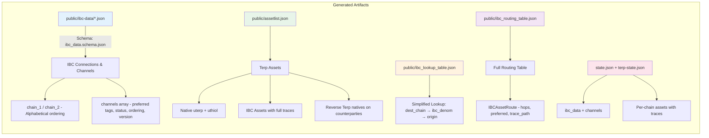
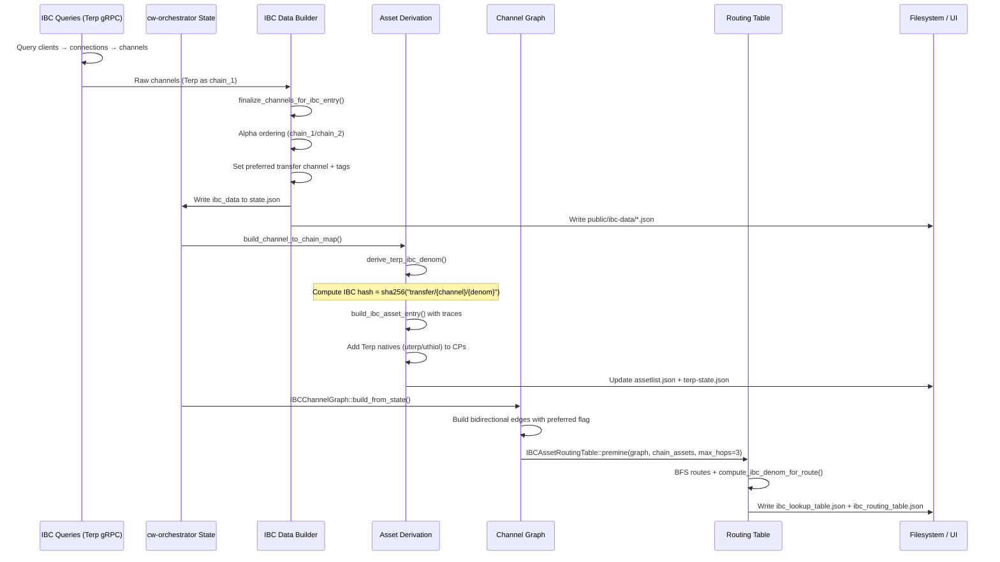

# Terp Network Test Suite

Date: 2026-06-12

---

## What this workspace is

`tests/` is the Terp Network integration, schema validation, and IBC asset derivation workspace.  
Package name: `scripts` (in `Cargo.toml`).

### Capabilities

1. **IBC info derivation** — `bin/ibc_info.rs` connects to live chains (Terp mainnet + connected chains), queries IBC clients/connections/channels, and generates:
   - Schema-compliant `ibc_data` JSON files (`public/{chain_1}-{chain_2}.json`)
   - `assetlist.json` with native Terp assets + chain-registry base denoms + derived IBC assets
   - `ibc_routing_table.json` — all possible multi-hop routes
   - `ibc_lookup_table.json` — simplified denom→origin lookup
   - All output validated against `asset_list.schema.json` and `ibc_data.schema.json`

2. **Contract deployment** — `TerpNetworkSuite` composes cw-orch sub-suites (DAO, SVG, headstash, billboards, shitstraps) and deploys them on any Terp chain.

3. **Sidecar lifecycle** — a fleet of off-chain services (hashmarket, merkle-server, indexer, MinIO, Nostr relay) that run alongside the chain during integration tests.

4. **Multi-chain IBC authenticity harness** — `#[ignore]`d 4-chain line Docker test (`tests/tests/ibc_multihop_harness.rs`) that proves predicted IBC denoms against live bank balances and denom traces (see below).

---

## Architecture

```
tests/
├── src/
│   ├── lib.rs                  # Public re-exports
│   ├── environments/           # Test environment primitives (nostr, quickspawn)
│   ├── ibc_core.rs             # Pure IBC derivation: denom hashes, channel graph, routing table
│   └── suite/                  # SidecarFleet + TerpSidecar trait + contract deployment
├── bin/
│   ├── e2e.rs                  # Full integration test binary (Docker sidecars)
│   ├── delegations.rs          # Delegation-specific test binary
│   └── ibc_info.rs             # IBC info derivation pipeline (live chains → public/ JSON files)
├── tests/
│   ├── nostr_orch_suite.rs     # Nostr relay integration tests
│   └── ibc_info.rs             # Schema validation + derivation unit tests (11 tests)
├── public/
│   ├── asset_list.schema.json  # Chain-registry asset list schema
│   ├── ibc_data.schema.json    # Chain-registry IBC data schema
│   ├── assetlist.json          # Generated asset list output
│   ├── state.json              # Chain state cache (used by ibc_info bin)
│   ├── ibc_routing_table.json  # Premined multi-hop routing table
│   └── ibc_lookup_table.json   # Simplified IBC denom lookup
└── Cargo.toml
```

---

## The IBC info pipeline (`bin/ibc_info.rs`)







This binary connects to live chain nodes (Terp mainnet, Osmosis, etc.), queries the IBC state, and produces schema-compliant output files:

```
cargo run --bin ibc
```

### What it generates

| File | Schema | Contents |
|------|--------|----------|
| `public/{a}-{b}.json` | `ibc_data.schema.json` | IBC channels, clients, connections per chain pair |
| `public/assetlist.json` | `asset_list.schema.json` | Native Terp assets + chain-registry base denoms + derived IBC assets |
| `public/ibc_routing_table.json` | (internal) | All multi-hop routes from BFS graph traversal |
| `public/ibc_lookup_table.json` | (simplified) | IBC denom → symbol/origin/trace lookup |

### Schema compliance

All output files are validated against the canonical chain-registry JSON schemas in `public/`:
- `asset_list.schema.json` — enforces required fields (`denom_units`, `type_asset`, `base`, `display`, `name`, `symbol`), trace type enums (`ibc`, `ibc-cw20`, `bridge`, ...), channel_id patterns (`^channel-\d+$`), `$schema` pointer
- `ibc_data.schema.json` — enforces `ordering` as `"ordered"|"unordered"` string (not int), `chain_1`/`chain_2` with `chain_name`/`chain_id`/`client_id`/`connection_id`, `tags` with `preferred`/`status`

---

## Core derivation module (`src/ibc_core.rs`)

Pure functions operating on state.json data — no chain dependency, usable in unit tests:

```rust
compute_ibc_denom_hash("transfer/channel-1/uakt")
// → "ibc/1480B8FD20AD5FCAE81EA87584D269547DD4D436843C1D20F15E00EB64743EF4"

IBCChannelGraph::build_from_state(&ibc_data)       // adjacency list from ibc_data entries
graph.find_routes("terp", "akash", 3)               // BFS with hop limit
graph.compute_ibc_denom_for_route("uakt", &route)   // denom from route
IBCAssetRoutingTable::premine(&graph, &assets, 4)   // all routes for all assets
```

---

## Schema validation tests (11 tests)

All synchronous, no Docker required. In `tests/tests/ibc_info.rs`:

| Test | What it validates |
|------|-------------------|
| `test_assetlist_schema_compliance` | Loads real `assetlist.json`, validates every asset against schema |
| `test_ibc_data_schema_via_constructed_entry` | Constructed entry with `"ordering": "unordered"`, `$schema`, `chain_1`/`chain_2` validates clean |
| `test_ibc_data_rejects_int_ordering` | Integer `1` for ordering correctly flagged as violation |
| `test_ibc_data_rejects_missing_tags` | Missing `preferred` in tags correctly flagged |
| `test_ibc_denom_computation_known_hashes` | SHA256 hashes match known AKT/ATONE values from assetlist |
| `test_channel_graph_and_routing_with_real_ibc_data` | Full pipeline with real state.json data |
| `test_routing_table_integrity` | Pre-computed table: 9 chains, 132 routes, hop count consistency |
| `test_ibc_lookup_table_integrity` | All lookup entries have required fields |
| `test_state_json_asset_structure` | Real state.json assets validated (6 entries, 0 violations) |
| `test_asset_entry_validation_rejects_bad_data` | Validator catches 5 missing fields + 2 pattern violations |
| `test_construct_ibc_data_and_run_derivation_pipeline` | End-to-end: construct → graph → routes → denoms → map |

---

## Multi-chain IBC authenticity harness (Docker, ignored)

**Implemented, not claimed green in CI.** Live proof lives in:

- Test: [`tests/tests/ibc_multihop_harness.rs`](tests/ibc_multihop_harness.rs) — `test_line_four_chain_tokenfactory_multihop`
- Notes: [`data/ibc/harness/README.md`](data/ibc/harness/README.md)

Topology: line **A—B—C—D** (`terp-a`…`terp-d`), Hermes links only on adjacent pairs, 16 tokenfactory denoms (4 per chain), scenarios 1–6 hop-by-hop ICS-20. Pass means **predict == denom_trace == bank balance denom**.

```sh
cargo test -p scripts --test ibc_multihop_harness -- --ignored --nocapture
```

Requires Docker and a Terp image (default `terpnetwork/terp-core:local-zk`, overridable via `ICT_IMAGE_*` / `TERP_IMAGE_*`). There is no `tests/tests/ibc_info.rs` multichain test; offline schema/derivation coverage is separate from this harness.

Pure path/hash helper checks in the same file run without Docker (not ignored).

---

## How to run

### Prerequisites

```sh
# Sidecar binaries
cargo build --bin hash-market-server -p hash-market --features "server,ve,blossom"
cargo build --bin hash-market-client -p hash-market --features "client"

# Docker images (for integration tests)
docker pull ghcr.io/terpnetwork/terp-core:v5.2.0-zk-localterp
```

### IBC info pipeline (lib-backed)

```sh
cargo run -p scripts --bin ibc -- generate   # default if no subcommand
cargo run -p scripts --bin ibc -- validate --public-dir ../public
cargo run -p scripts --bin ibc -- compare --public-dir ../public --strict
```

`generate` runs `scripts::ibc::check_invariants` and **fails closed** on hard errors. Writes `public/ibc_generation_meta.json`.

### Offline IBC helpers / unit tests (no Docker)

```sh
# Pure path prediction helpers in the multihop harness file (not ignored)
cargo test -p scripts --test ibc_multihop_harness -- --nocapture

# Lib pure derivation (ibc_core)
cargo test -p scripts --lib ibc_core -- --nocapture
```

### Live multi-hop authenticity (Docker, ignored)

```sh
cargo test -p scripts --test ibc_multihop_harness -- --ignored --nocapture
```

### Full integration e2e

```sh
cargo run --bin e2e --features docker,nostr
```

---

## Feature flags

| Flag | Default | Description |
|------|---------|-------------|
| `docker` | yes | Docker sidecars (MinIO, indexer, relayer). Requires Docker daemon |
| `nostr` | yes | Nostr relay suite |

Default features: `docker, nostr`

---

## Output files

The `public/` directory is treated as the build output directory for generated IBC data and asset lists. The `ibc_info` binary writes all output here. The schema validation tests load from here. The files can be published to a static site or CDN.